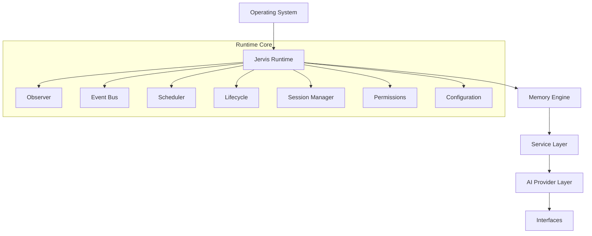
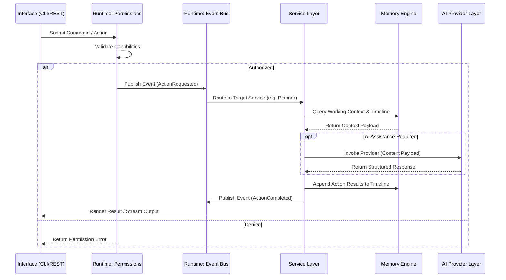
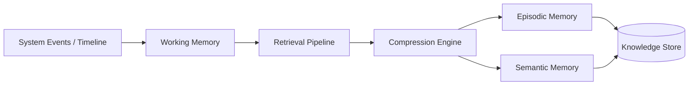
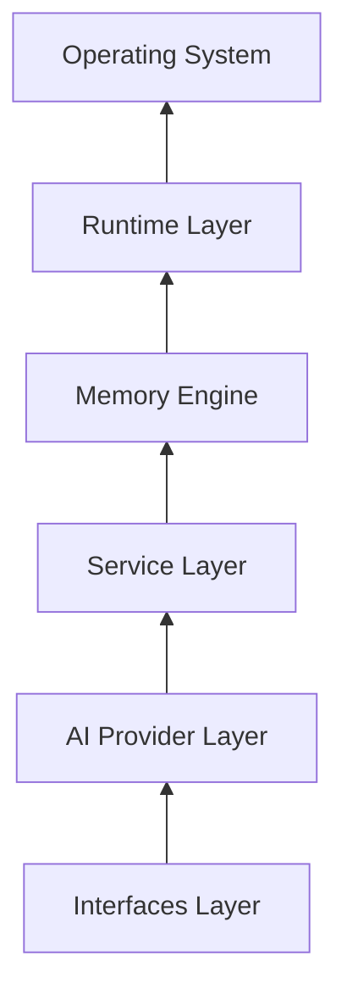

# Canonical Architecture

## 1. Architectural Overview & Ownership Model

Jervis follows a strict **Top-Down Single-Direction Hierarchy** where the **Runtime** owns system execution, state, and security. AI is **NEVER** the owner or driver of the runtime; it is strictly an external consumer that receives context payloads and returns structured responses. The system remains 100% functional for deterministic workflows even if all AI providers are removed.

```
OS
↓
Runtime (Observer, Event Bus, Scheduler, Lifecycle, Session Manager, Permissions, Configuration)
↓
Memory Engine (Working Memory, Episodic Memory, Semantic Memory, Timeline, Retrieval, Compression, Knowledge Store)
↓
Service Layer (Planner, Projects, Meetings, Habits, Notion, Calendar, Automation)
↓
AI Provider Layer (OpenAI, Claude, Gemini, Ollama, Local Models, Future Providers)
↓
Interfaces (CLI, MCP Server, REST API, Desktop, Menu Bar, Future Interfaces)
```

---

## 2. Layer Definitions & Subcomponents

### Layer 1: Runtime (System Owner)
The foundation of Jervis running directly on the host Operating System.
- **Observer**: Monitors execution health, system state changes, and metrics. *Never calls AI.*
- **Event Bus**: Asynchronous message broker delivering system events. *Never calls AI.*
- **Scheduler**: Triggers cron, interval, and deferred background tasks.
- **Lifecycle**: Manages application boot, initialization, shutdown, and process signals.
- **Session Manager**: Manages active user sessions, workspace contexts, and state isolation.
- **Permissions**: Enforces capability access control (filesystem, network, process execution) before any action runs.
- **Configuration**: Loads, validates, and manages immutable runtime configuration.

### Layer 2: Memory Engine
Manages state history, context aggregation, and knowledge retrieval. *Completely decoupled from AI.*
- **Working Memory**: In-memory active context and sliding conversation state.
- **Episodic Memory**: Logged historical interaction episodes and outcomes.
- **Semantic Memory**: Knowledge graph and relational factual facts.
- **Timeline**: Chronological, immutable append-only ledger of all system events.
- **Retrieval**: Algorithmic lookup, keyword index, and similarity retrieval interfaces.
- **Compression**: Heuristic and rule-based summarization and token window truncation.
- **Knowledge Store**: Persistent storage drivers for documents, notes, and metadata.

### Layer 3: Service Layer
Implements domain business logic and local integrations. *Never depends on specific AI providers or UIs.*
- **Planner**: Task decomposition, dependency mapping, and deterministic scheduling.
- **Projects**: Management of local repositories, task tracking, and milestone tracking.
- **Meetings**: Calendar sync, agenda preparation, and transcript/notes handling.
- **Habits**: Tracking recurring behaviors, statistics, and reminders.
- **Notion**: Integration service for Notion databases and pages.
- **Calendar**: Local and remote calendar integration (iCal, Google Calendar API).
- **Automation**: Executable local scripts, shell workflows, and webhooks.

### Layer 4: AI Provider Layer
Standardized pluggable abstraction for language model inference. *Consumes context, produces responses.*
- **OpenAI**: Adapter for OpenAI API (GPT models).
- **Claude**: Adapter for Anthropic API (Claude models).
- **Gemini**: Adapter for Google Gemini API.
- **Ollama**: Adapter for local Ollama instances.
- **Local Models**: Direct bindings for local GGUF/llama.cpp/ONNX models.
- **Future Providers**: Extensible provider interface for emerging LLM backends.

### Layer 5: Interfaces
The external boundary exposing Jervis functionality to clients. *Contains zero business logic.*
- **CLI**: Command line interface for shell interactions.
- **MCP Server**: Model Context Protocol implementation for external AI tools.
- **REST API**: HTTP/JSON interface for local/remote client applications.
- **Desktop**: Native graphical desktop application wrapper.
- **Menu Bar**: Lightweight background status bar indicator and quick action widget.
- **Future Interfaces**: WebSocket, gRPC, or IDE plugin endpoints.

---

## 3. Mandatory Design Rules

1. **Observer never calls AI.**
2. **Event Bus never calls AI.**
3. **Memory never depends on AI.**
4. **Services never depend on a specific provider.**
5. **Runtime knows nothing about OpenAI, Claude, Gemini or any vendor.**
6. **Everything communicates through interfaces.**
7. **No cyclic dependency.**
8. **The runtime must continue working if every AI provider is removed.**
9. **Interfaces never contain business logic.**
10. **Business logic never depends on UI.**
11. **Storage is implementation detail.**
12. **Plugins cannot bypass Runtime.**
13. **Permissions are enforced before execution.**
14. **Runtime owns state.**
15. **AI only consumes context and produces responses.**

---

## 4. System Flows & Diagrams

### Runtime Ownership Diagram


### Event Flow


### Memory Flow


### Dependency Graph

