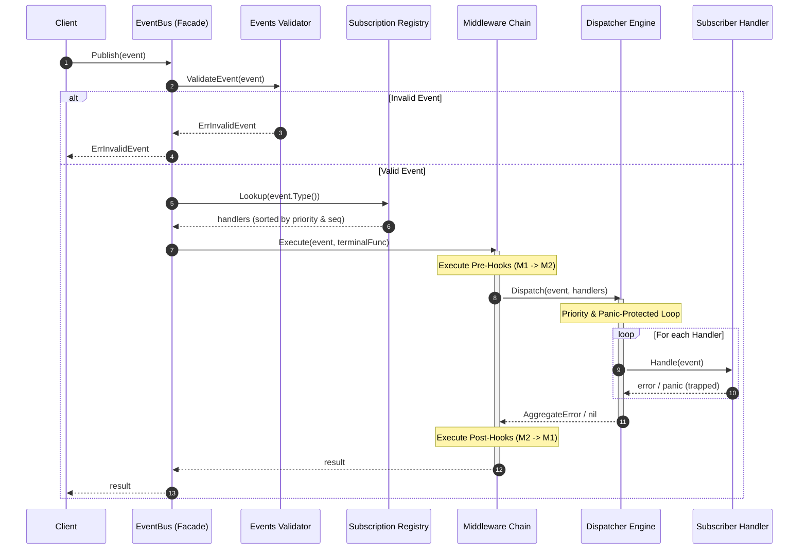
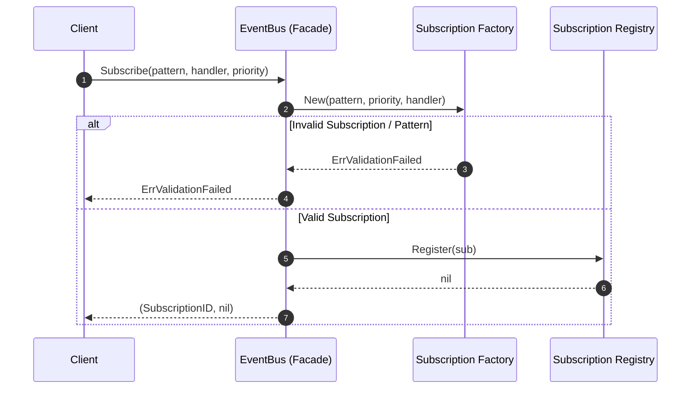
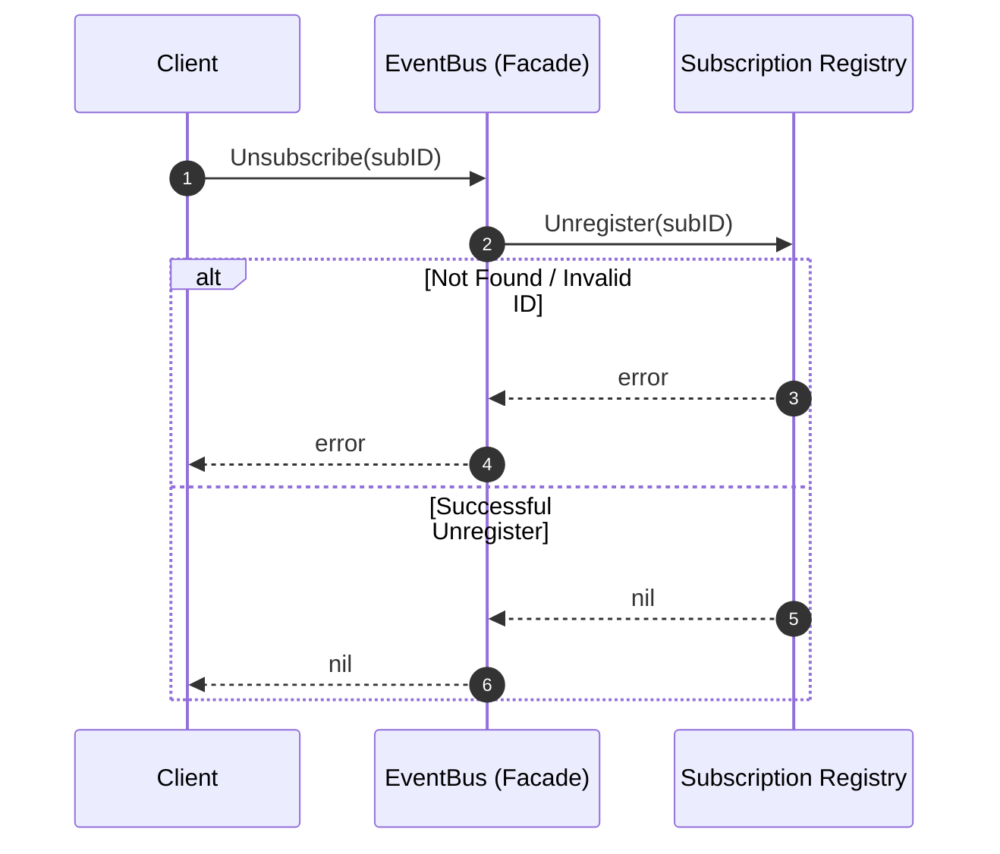

# Event Bus Facade Sequence Diagrams

## 1. Publish Sequence Diagram

```mermaid
sequenceDiagram
    autonumber
    participant Client
    participant Bus as EventBus (Facade)
    participant Validation as Events Validator
    participant Registry as Subscription Registry
    participant Middleware as Middleware Chain
    participant Dispatcher as Dispatcher Engine
    participant Handler as Subscriber Handler

    Client->>Bus: Publish(event)
    Bus->>Validation: ValidateEvent(event)
    alt Invalid Event
        Validation-->>Bus: ErrInvalidEvent
        Bus-->>Client: ErrInvalidEvent
    else Valid Event
        Bus->>Registry: Lookup(event.Type())
        Registry-->>Bus: handlers (sorted by priority & seq)
        Bus->>Middleware: Execute(event, terminalFunc)
        activate Middleware
        Note over Middleware: Execute Pre-Hooks (M1 -> M2)
        Middleware->>Dispatcher: Dispatch(event, handlers)
        activate Dispatcher
        Note over Dispatcher: Priority & Panic-Protected Loop
        loop For each Handler
            Dispatcher->>Handler: Handle(event)
            Handler-->>Dispatcher: error / panic (trapped)
        end
        Dispatcher-->>Middleware: AggregateError / nil
        deactivate Dispatcher
        Note over Middleware: Execute Post-Hooks (M2 -> M1)
        Middleware-->>Bus: result
        deactivate Middleware
        Bus-->>Client: result
    end
```

---

## 2. Subscribe Sequence Diagram

```mermaid
sequenceDiagram
    autonumber
    participant Client
    participant Bus as EventBus (Facade)
    participant Subscription as Subscription Factory
    participant Registry as Subscription Registry

    Client->>Bus: Subscribe(pattern, handler, priority)
    Bus->>Subscription: New(pattern, priority, handler)
    alt Invalid Subscription / Pattern
        Subscription-->>Bus: ErrValidationFailed
        Bus-->>Client: ErrValidationFailed
    else Valid Subscription
        Bus->>Registry: Register(sub)
        Registry-->>Bus: nil
        Bus-->>Client: (SubscriptionID, nil)
    end
```

---

## 3. Unsubscribe Sequence Diagram

```mermaid
sequenceDiagram
    autonumber
    participant Client
    participant Bus as EventBus (Facade)
    participant Registry as Subscription Registry

    Client->>Bus: Unsubscribe(subID)
    Bus->>Registry: Unregister(subID)
    alt Not Found / Invalid ID
        Registry-->>Bus: error
        Bus-->>Client: error
    else Successful Unregister
        Registry-->>Bus: nil
        Bus-->>Client: nil
    end
```
