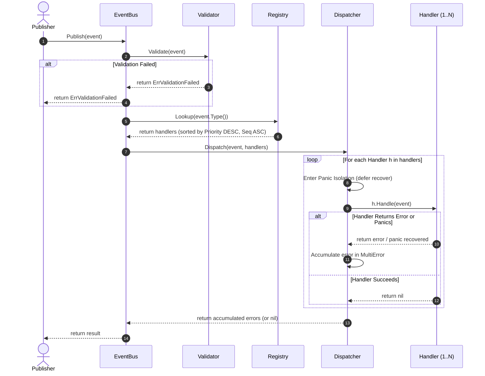

# Event Dispatch Sequence Diagram Specification

## 1. Sequence Overview

This sequence diagram specifies the interaction between the `Publisher`, `EventBus`, `Validator`, `Registry`, `Dispatcher`, and `Handler` components during a publish operation.

---

## 2. Step-by-Step Execution Sequence

1. **Publisher Calls `Publish(event)`**: Publisher calls the Event Bus facade `Publish` method on the caller's call stack.
2. **Event Validation**: Event Bus invokes `Validator.Validate(event)`. If validation fails, `Publish` returns `ErrValidationFailed` immediately without searching for subscribers.
3. **Registry Lookup**: Event Bus queries `Registry.Lookup(event.Type())`. The Registry returns a sorted, defensive slice of matching handlers.
4. **Dispatcher Invocation**: Event Bus passes the event and ordered handler slice to `Dispatcher.Dispatch(event, handlers)`.
5. **Panic Isolation & Handler Execution**: Dispatcher iterates through handlers. Each `Handle(event)` call is protected by a local panic recovery block.
6. **Error Accumulation & Continuation**: If a handler panics or returns an error, Dispatcher captures the error and continues executing the remaining handlers in the list.
7. **Result Return**: Dispatcher returns a composite error (or `nil` if all handlers succeeded) back to the Event Bus and Publisher.
