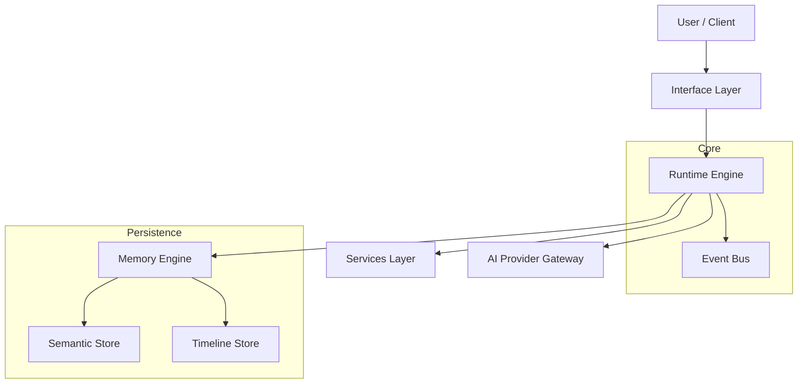

# jervis

[](https://go.dev/)
[](https://github.com/saaedimam/jervis/actions/workflows/ci.yml)
[](https://codecov.io/gh/saaedimam/jervis)
[](LICENSE)
[](https://github.com/saaedimam/jervis/releases)
[](https://goreportcard.com/report/github.com/saaedimam/jervis)
[](https://github.com/saaedimam/jervis/actions/workflows/codeql.yml)

**jervis** is a local-first personal operating system and runtime designed for agentic AI context management. It provides a deterministic environment for AI agents to interact with local tools, memory, and services.

---

## 🏛️ Architecture



Detailed documentation is available in [ARCHITECTURE.md](ARCHITECTURE.md).

---

## 🚀 Installation

### Prerequisites
- Go 1.22+
- macOS (Linux/Windows support in progress)

### Install via Homebrew
```bash
brew tap saaedimam/jervis
brew install jervis
```

### Build from Source
```bash
git clone https://github.com/saaedimam/jervis.git
cd jervis
make build
```

---

## ⚡ Quick Start

Start the jervis daemon:
```bash
jervis start
```

Verify the status:
```bash
jervis status
```

---

## 🛠️ CLI Examples

```bash
# Register a new service
jervis service register notion --key <API_KEY>

# Query the semantic memory
jervis memory query "What were the notes from yesterday's meeting?"

# Execute a task
jervis run "Summarize my unread emails from the last 2 hours"
```

---

## 🗺️ Roadmap

- [x] Phase 1.0: Runtime Foundation & Deterministic Lifecycle
- [ ] Phase 2.0: Context Engine & Semantic Memory
- [ ] Phase 3.0: OS Integration & Tooling
- [ ] Phase 4.0: Ecosystem & Plugins

See the full [ROADMAP.md](ROADMAP.md) for details.

---

## 📚 Documentation

- [Developer Guide](https://ioriimasu.github.io/jervis/)
- [API Reference](https://ioriimasu.github.io/jervis/api)
- [Plugin Development](https://ioriimasu.github.io/jervis/plugins)

---

## 🤝 Contributing

We welcome contributions! Please see [CONTRIBUTING.md](CONTRIBUTING.md) and our [Governance Setup](GITHUB_SETUP.md) for guidelines on branching, commits, and PRs.

---

## 📄 License

jervis is licensed under the [Apache License 2.0](LICENSE).
