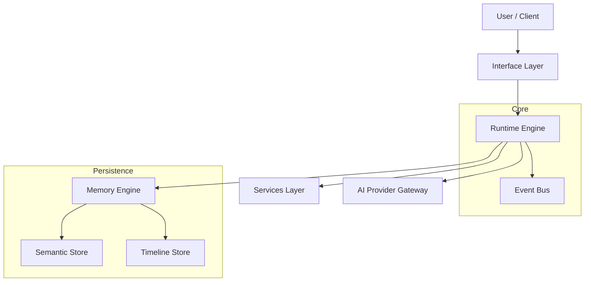

# jervis

[](https://go.dev/)
[](https://github.com/saaedimam/jervis/actions/workflows/ci.yml)
[](https://codecov.io/gh/saaedimam/jervis)
[](LICENSE)
[](https://github.com/saaedimam/jervis/releases)

**jervis** is a local-first personal operating system and runtime for agentic AI context management. It provides a deterministic environment where AI agents interact with local tools, memory, and services — without leaking data or depending on cloud uptime.

## Quick Start

```bash
# macOS (Homebrew)
brew tap saaedimam/jervis
brew install jervis

# Or build from source
git clone https://github.com/saaedimam/jervis.git
cd jervis
make build
```

```bash
# Start the runtime daemon
jervis daemon

# Verify via MCP
jervis mcp --help
```

## Architecture



The runtime owns all state, events, and permissions. AI providers are strictly downstream consumers. See [docs/README.md](docs/README.md) for the full documentation index.

## Project Status

- **Phase 1**: Runtime Foundation ✅
- **Phase 2**: Memory & Context Engine ✅
- **Phase 3**: Domain Services ✅
- **Phase 4**: AI Provider Layer ✅
- **Phase 5**: Interfaces (CLI, MCP, REST) ✅

238/238 tests passing. Race detector clean.

## Contributing

See [CONTRIBUTING.md](CONTRIBUTING.md) for commit conventions, branch hygiene, and PR templates. All changes require review via Pull Request.

## License

[Apache License 2.0](LICENSE)
