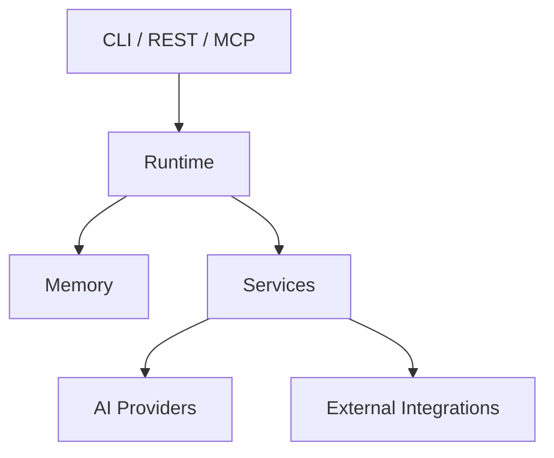

# jervis

[](https://go.dev/)
[](https://github.com/saaedimam/jervis/actions/workflows/ci.yml)
[](https://github.com/saaedimam/jervis/actions/workflows/codeql.yml)
[](https://codecov.io/gh/saaedimam/jervis)
[](LICENSE)

Jervis is a local-first runtime for deterministic automation, persistent memory, and optional AI-assisted workflows.

It provides a single runtime for local services and interfaces such as the CLI, REST API, and MCP server. Core execution does not require an AI provider; external integrations are enabled explicitly through configuration.

---

## Why Jervis?

- **Deterministic core** — runtime execution and state management do not depend on probabilistic AI output.
- **Local-first operation** — core data and services run locally by default.
- **AI as an optional dependency** — providers consume context without owning runtime state.
- **Explicit boundaries** — runtime, memory, services, providers, and interfaces have defined dependency directions.
- **Multiple interfaces, one runtime** — CLI, REST, and MCP expose the same underlying system.

---

## Features

**Runtime and local services**

- Persistent memory
- Task and project management
- Automation services
- Calendar import and export
- Background daemon

**Optional integrations**

- Notion synchronization
- OpenAI
- Anthropic
- Google Gemini
- Ollama

**Interfaces**

- CLI
- REST API
- MCP server

---

## Quick Start

Requires Go as specified by [`go.mod`](go.mod).

### Installation

```bash
git clone https://github.com/saaedimam/jervis.git
cd jervis
make build
```

### Run

```bash
./bin/jervis version
```

### Verify

```bash
./bin/jervis planner -create -id task-001 -title "First Jervis task"
./bin/jervis planner -list
```

No AI provider or external service is required for these commands.

---

## Minimal Example

Create and retrieve a local task:

```bash
./bin/jervis planner -create -id task-001 -title "Review architecture invariants"
./bin/jervis planner -list
```

Jervis stores planner state locally in `jervis.db`.

---

## Architecture



The runtime owns execution and state. Memory is independent of AI, while domain services use providers and external integrations only when required.

For the canonical design, see [`docs/architecture/`](docs/architecture/), the [architecture overview](docs/architecture/ARCHITECTURE.md), and [architecture invariants](docs/architecture/ARCHITECTURE_INVARIANTS.md).

---

## Configuration

Core local operation requires no environment variables.

| Variable | Required | Default | Description |
|-----------|----------|---------|-------------|
| `NOTION_TOKEN` | No | — | Enables Notion integration |
| `MASTER_CONTEXT_ID` | No | — | Notion page used for context synchronization |
| `TASKS_DB` | No | — | Notion tasks database |
| `PACKAGES_DB` | No | — | Notion projects/packages database |
| `MILESTONES_DB` | No | — | Notion milestones database |
| `ADRS_DB` | No | — | Notion ADR database |
| `SPECIFICATIONS_DB` | No | — | Notion specifications database |
| `OPENAI_API_KEY` | No | — | Enables the OpenAI provider |
| `ANTHROPIC_API_KEY` | No | — | Enables the Anthropic provider |
| `GOOGLE_API_KEY` | No | — | Enables the Google provider |
| `OLLAMA_BASE_URL` | No | — | Ollama server base URL |

Jervis loads environment variables from the process environment and attempts to load a local `.env` file at startup.

---

## CLI Reference

| Command | Purpose |
|---------|---------|
| `version` | Show build and version information |
| `planner` | Create and list planned tasks |
| `sync` | Synchronize supported state with Notion |
| `calendar` | Import or export iCalendar data |
| `chat` | Send prompts through a configured AI provider |
| `mcp` | Start the MCP server |
| `api` | Start the REST API |
| `automation` | Manage automation workflows |
| `daemon` | Start the runtime daemon |

Use command-specific help for available flags:

```bash
./bin/jervis planner --help
./bin/jervis sync --help
./bin/jervis calendar --help
./bin/jervis chat --help
./bin/jervis api --help
./bin/jervis automation --help
```

---

## Documentation

| Topic | Location |
|-------|----------|
| Documentation index | [`docs/README.md`](docs/README.md) |
| Architecture | [`docs/architecture/`](docs/architecture/) |
| Architecture overview | [`docs/architecture/ARCHITECTURE.md`](docs/architecture/ARCHITECTURE.md) |
| Architecture invariants | [`docs/architecture/ARCHITECTURE_INVARIANTS.md`](docs/architecture/ARCHITECTURE_INVARIANTS.md) |
| Specifications | [`docs/specs/`](docs/specs/) |
| ADRs | [`docs/adr/`](docs/adr/) |
| Engineering principles | [`docs/principles/engineering.md`](docs/principles/engineering.md) |
| Security model | [`docs/architecture/06_SECURITY_MODEL.md`](docs/architecture/06_SECURITY_MODEL.md) |
| Testing strategy | [`docs/architecture/05_TESTING_STRATEGY.md`](docs/architecture/05_TESTING_STRATEGY.md) |
| Roadmap | [`docs/adr/ROADMAP.md`](docs/adr/ROADMAP.md) |
| Contributing | [`CONTRIBUTING.md`](CONTRIBUTING.md) |

---

## Development

```bash
make test
make lint
make build
```

`make test` runs the Go test suite with the race detector. `make lint` requires `golangci-lint`.

---

## Contributing

Contributions should preserve Jervis's architectural boundaries, deterministic runtime behavior, and test requirements.

Read [`CONTRIBUTING.md`](CONTRIBUTING.md) before opening a pull request.

---

## Roadmap

The project roadmap is organized around four high-level areas:

- Core runtime and memory
- Domain services and local automation
- AI provider integrations
- Interface and ecosystem expansion

See [`docs/adr/ROADMAP.md`](docs/adr/ROADMAP.md) for the canonical roadmap and current scope.

---

## License

Jervis is licensed under the [Apache License 2.0](LICENSE).
