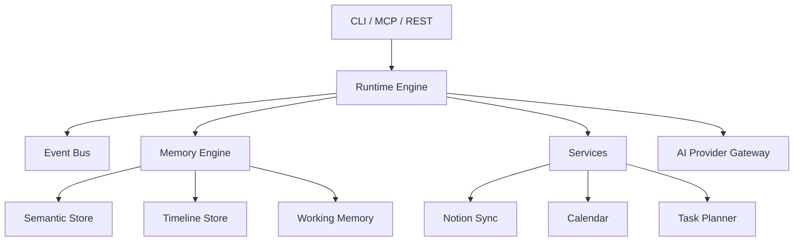

# jervis

[](https://go.dev/)
[](https://github.com/saaedimam/jervis/actions/workflows/ci.yml)
[](https://codecov.io/gh/saaedimam/jervis)
[](LICENSE)

jervis is a local-first runtime and context operating system for AI agents. It provides deterministic state management, event-driven architecture, and memory persistence—running entirely on your machine without cloud dependencies.

---

## Why Jervis?

- **Data sovereignty**: All context, memory, and state stay local. No cloud APIs required for core functionality.
- **Agentic workflows**: Built for AI agents that need persistent memory, event handling, and tool orchestration.
- **Deterministic execution**: Runtime engine owns all state, events, and permissions. AI providers are downstream consumers.
- **Extensible interfaces**: CLI, MCP server, REST API, and daemon mode for integration with any agentic framework.

---

## Features

- **Runtime Engine**: Lifecycle management, event bus, observer pattern, scheduler
- **Memory System**: Semantic store, timeline store, episodic memory, working memory
- **Services Layer**: Task planner, Notion sync, calendar integration, automation workflows
- **AI Provider Gateway**: Anthropic, OpenAI, Google Gemini, Ollama
- **Interfaces**: CLI, MCP server, REST API, daemon mode

---

## Quick Start

### Install

```bash
# macOS (Homebrew)
brew tap saaedimam/jervis
brew install jervis

# Or build from source
git clone https://github.com/saaedimam/jervis.git
cd jervis
make build
```

### Run

```bash
# Start the daemon
jervis daemon

# In another terminal, chat with AI
jervis chat --provider anthropic --model claude-sonnet-4

# Or start the MCP server for IDE integration
jervis mcp
```

### Verify

```bash
jervis version
```

---

## Minimal Example

```bash
# Start daemon and verify it's running
jervis daemon &
sleep 2
jervis planner add "Hello world"
jervis planner list
```

---

## Architecture



The runtime engine orchestrates all state, events, and permissions. See [docs/architecture/ARCHITECTURE.md](docs/architecture/ARCHITECTURE.md) for details.

---

## Configuration

| Variable | Required | Default | Description |
|----------|----------|---------|-------------|
| `ANTHROPIC_API_KEY` | For Anthropic | - | Anthropic API key |
| `OPENAI_API_KEY` | For OpenAI | - | OpenAI API key |
| `GOOGLE_API_KEY` | For Gemini | - | Google AI API key |
| `NOTION_API_KEY` | For Notion sync | - | Notion integration token |
| `JERVIS_DATA_DIR` | No | `~/.jervis` | Local data directory |
| `JERVIS_PORT` | No | `8080` | REST API port |

Configuration is read from environment variables. See [docs/architecture/04_CODING_STANDARD.md](docs/architecture/04_CODING_STANDARD.md) for details.

---

## CLI Reference

| Command | Description |
|---------|-------------|
| `jervis version` | Show build information |
| `jervis daemon` | Start runtime background daemon |
| `jervis chat` | Chat with AI providers |
| `jervis mcp` | Start MCP server |
| `jervis api` | Start REST API server |
| `jervis planner` | Manage planned tasks |
| `jervis sync` | Sync local state to Notion |
| `jervis calendar` | Manage calendar integrations |
| `jervis automation` | Manage automation workflows |

---

## Documentation

| Topic | Location |
|-------|----------|
| Architecture | [docs/architecture/ARCHITECTURE.md](docs/architecture/ARCHITECTURE.md) |
| Invariants | [docs/architecture/ARCHITECTURE_INVARIANTS.md](docs/architecture/ARCHITECTURE_INVARIANTS.md) |
| Security Model | [docs/architecture/06_SECURITY_MODEL.md](docs/architecture/06_SECURITY_MODEL.md) |
| Release Strategy | [docs/architecture/07_RELEASE_STRATEGY.md](docs/architecture/07_RELEASE_STRATEGY.md) |
| Contributing | [CONTRIBUTING.md](CONTRIBUTING.md) |

---

## Development

```bash
make test        # Run all tests with race detector
make lint       # Run golangci-lint
make build      # Build binaries
make clean      # Clean build artifacts
```

---

## Contributing

Contributions are welcome. See [CONTRIBUTING.md](CONTRIBUTING.md) for commit conventions, branch hygiene, and PR templates. All changes require review via pull request.

---

## Roadmap

- [x] v1.0.0 — Runtime foundation, memory engine, services, AI providers
- [ ] v1.1.0 — Enhanced MCP toolset
- [ ] v1.2.0 — Plugin system
- [ ] v2.0.0 — Distributed context sharing

See [docs/releases/](docs/releases/) for detailed release notes.

---

## License

[Apache License 2.0](LICENSE)
