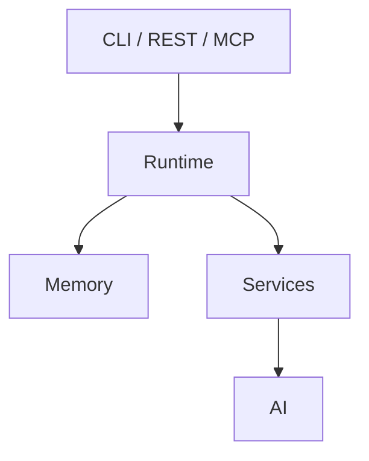

# jervis

[](https://go.dev/)
[](https://github.com/saaedimam/jervis/actions/workflows/ci.yml)
[](https://github.com/saaedimam/jervis/actions/workflows/codeql.yml)
[](https://codecov.io/gh/saaedimam/jervis)
[](LICENSE)

> **Status**
>
> Active development. APIs and CLI may evolve before v1.0. Stable architectural invariants are documented in `docs/architecture/ARCHITECTURE_INVARIANTS.md`.

Jervis is a local-first runtime and context operating system for deterministic automation, persistent memory, and AI-assisted workflows. The runtime remains fully functional without an AI provider; AI augments services rather than owning execution.

---

## Why Jervis?

- **Determinism over probability.** The runtime executes deterministically. AI is isolated downstream and never controls system state.
- **Local sovereignty.** All data stays on your machine by default. Cloud access is opt-in and explicitly authorized per service.
- **AI-optional by design.** Core runtime functionality does not require an AI provider.
- **Single-direction architecture.** Dependencies flow strictly downward. No upward calls. No cycles.
- **Extensible interfaces.** CLI, REST API, MCP server, and daemon mode over the same runtime core.

> **Design Principle**
>
> Runtime owns execution. AI consumes context. AI never owns state.

---

## Who is Jervis for?

Jervis is intended for developers building:

- AI agents
- Local automation
- MCP tooling
- Personal knowledge systems
- Deterministic workflows

It is not intended to be a cloud orchestration platform or a hosted AI service.

---

## Features

- **Local runtime** — daemon mode with lifecycle management
- **Persistent memory** — working memory, timeline, and semantic store
- **Task planner** — create, list, and manage tasks
- **Notion synchronization** — sync context, tasks, projects, milestones, ADRs, and specifications
- **Calendar integration** — iCal import and export
- **AI provider integration** — adapters for OpenAI, Anthropic, Google Gemini, and Ollama
- **MCP server** — Model Context Protocol for external AI tool integration
- **REST API** — local and remote client access
- **Automation** — pluggable workflow registry

---

## Quick Start

**Prerequisites**

- Go 1.22+
- macOS (Linux and Windows support planned)

**Build from source**

```bash
git clone https://github.com/saaedimam/jervis.git
cd jervis
make build
```

**Run**

```bash
./bin/jervis daemon
```

**Verify**

```bash
./bin/jervis version
```

---

## Minimal Example

```bash
./bin/jervis planner --create --id task-001 --title "Review architecture invariants"
./bin/jervis planner --list
```

---

## Architecture



The Runtime owns all execution, state, and permissions. Memory is fully decoupled from AI. Services handle domain logic and call AI providers only when explicitly needed.

See [docs/architecture/ARCHITECTURE.md](docs/architecture/ARCHITECTURE.md) for layer definitions and [docs/architecture/ARCHITECTURE_INVARIANTS.md](docs/architecture/ARCHITECTURE_INVARIANTS.md) for enforced invariants.

---

## Configuration

Jervis reads configuration from environment variables.

| Variable | Used by | Description |
|----------|---------|-------------|
| `NOTION_TOKEN` | Notion sync | Notion integration token |
| `MASTER_CONTEXT_ID` | Notion sync | Notion page ID for context sync |
| `TASKS_DB` | Notion sync | Notion database ID for task sync |
| `PACKAGES_DB` | Notion sync | Notion database ID for project sync |
| `MILESTONES_DB` | Notion sync | Notion database ID for milestone sync |
| `ADRS_DB` | Notion sync | Notion database ID for ADR sync |
| `SPECIFICATIONS_DB` | Notion sync | Notion database ID for spec sync |
| `OPENAI_API_KEY` | OpenAI provider | Enables OpenAI chat |
| `ANTHROPIC_API_KEY` | Anthropic provider | Enables Anthropic Claude chat |
| `GOOGLE_API_KEY` | Gemini provider | Enables Google Gemini chat |
| `OLLAMA_BASE_URL` | Ollama provider | Base URL for local Ollama instance |

No AI provider key is required to run the daemon or use core services.

---

## CLI Reference

| Command | Description |
|---------|-------------|
| `jervis daemon` | Start the runtime background daemon |
| `jervis version` | Print build info |
| `jervis planner` | Manage tasks (`--create`, `--list`) |
| `jervis sync` | Sync local state to Notion |
| `jervis calendar` | Calendar import/export |
| `jervis chat` | Chat with AI providers |
| `jervis mcp` | Start MCP server (stdio transport) |
| `jervis api` | Start REST API server |
| `jervis automation` | Manage automation workflows |

Run `jervis [command] --help` for full flag documentation.

---

## Documentation

| Start here | |
|------------|--|
| Architecture overview | [docs/architecture/ARCHITECTURE.md](docs/architecture/ARCHITECTURE.md) |
| Documentation index | [docs/README.md](docs/README.md) |
| Contributing | [CONTRIBUTING.md](CONTRIBUTING.md) |
| Roadmap | [docs/adr/ROADMAP.md](docs/adr/ROADMAP.md) |

<details>
<summary>Additional documentation</summary>

| Topic | Location |
|--------|----------|
| Architecture invariants | [docs/architecture/ARCHITECTURE_INVARIANTS.md](docs/architecture/ARCHITECTURE_INVARIANTS.md) |
| Engineering principles | [docs/principles/engineering.md](docs/principles/engineering.md) |
| Testing strategy | [docs/architecture/05_TESTING_STRATEGY.md](docs/architecture/05_TESTING_STRATEGY.md) |
| Security model | [docs/architecture/06_SECURITY_MODEL.md](docs/architecture/06_SECURITY_MODEL.md) |
| Release strategy | [docs/architecture/07_RELEASE_STRATEGY.md](docs/architecture/07_RELEASE_STRATEGY.md) |
| CI/CD specification | [docs/architecture/CI_CD_SPECIFICATION.md](docs/architecture/CI_CD_SPECIFICATION.md) |
| ADR process | [docs/architecture/ADR_GUIDE.md](docs/architecture/ADR_GUIDE.md) |
| ADR decisions | [docs/adr/DECISIONS.md](docs/adr/DECISIONS.md) |
| Governance & constitution | [docs/adr/CONSTITUTION.md](docs/adr/CONSTITUTION.md) |
| Quality gates | [docs/adr/QUALITY_GATES.md](docs/adr/QUALITY_GATES.md) |
| Runtime specs | [docs/specs/runtime/](docs/specs/runtime/) |
| Security specs | [docs/specs/security/](docs/specs/security/) |
| Repository governance | [docs/architecture/GITHUB_SETUP.md](docs/architecture/GITHUB_SETUP.md) |

</details>

---

## Development

```bash
make build        # Build binary to bin/jervis
make test         # Run tests with race detector
make lint         # Run golangci-lint
```

See [docs/README.md](docs/README.md) for architecture, specifications, ADRs, and engineering principles.

All pull requests must pass CI, lint, and test gates before merge. See [CONTRIBUTING.md](CONTRIBUTING.md) for branch conventions and commit format.

---

## Contributing

Jervis follows [Conventional Commits](https://www.conventionalcommits.org/) and a strict architectural review process for changes to layer boundaries or invariants. Read [CONTRIBUTING.md](CONTRIBUTING.md) before opening a pull request.

---

## Roadmap

See [docs/adr/ROADMAP.md](docs/adr/ROADMAP.md) for the full roadmap.

---

## License

Jervis is licensed under the [Apache License 2.0](LICENSE).
